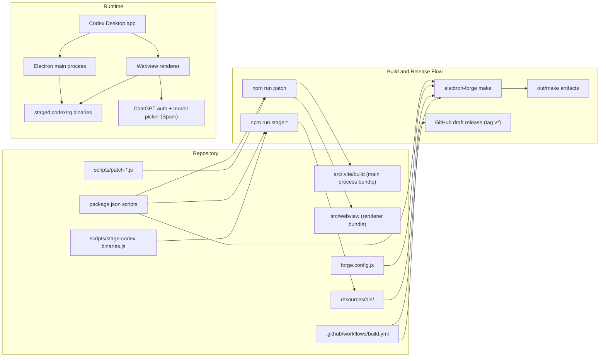

# Codex Desktop Rebuild - Maintained Fork

This is a maintained fork focused on keeping Codex Desktop builds and releases working across platforms with a simple install path for users.

## Why this fork exists

This fork keeps the desktop rebuild current and easy to install, with ongoing maintenance for release pipelines, binary staging, and packaging updates.

## Latest release and CLI version

- Latest fork release: `v1.0.4`
- This repo is currently pinned to: `@openai/codex 0.101.0`
- Upstream npm latest `@openai/codex`: `0.101.0` (checked on February 14, 2026)

## Spark support

- Stable path enabled: this fork now tracks `@openai/codex 0.101.0`, which includes support for Codex Spark model availability in current Codex app/CLI releases.
- Scope for this repo: stable ChatGPT sign-in flow support.
- Bundled webview assets are unchanged by default; fallback model-allowlist patching is only needed if Spark does not appear or execute in your environment.

## Download

- Latest release page: [https://github.com/chrisbuchanpham/CodexDesktop-Rebuild/releases/latest](https://github.com/chrisbuchanpham/CodexDesktop-Rebuild/releases/latest)
- Windows installer example: [https://github.com/chrisbuchanpham/CodexDesktop-Rebuild/releases/download/v1.0.4/Codex-1.0.4.Setup.exe](https://github.com/chrisbuchanpham/CodexDesktop-Rebuild/releases/download/v1.0.4/Codex-1.0.4.Setup.exe)

## Quick install

1. Download the latest `.exe` from Releases.
2. Run the installer.
3. Launch Codex.

## Build from source

```bash
npm install
npm run stage:host
npm run dev
```

`npm run stage:host` is required before local startup so the runtime binaries are available.

## Build commands

- `npm run build`
- `npm run build:all`
- `npm run build:win-x64`
- `npm run build:mac-x64`
- `npm run build:mac-arm64`
- `npm run build:linux-x64`
- `npm run build:linux-arm64`
- `npm run stage:host`
- `npm run stage:all`

## Comprehensive Stability Verification

- Stability Gate Status: `BLOCKED`
- Last Verified (UTC): `2026-02-14T16:46:09Z`
- Verification Date: `February 14, 2026`
- Commit: `a45045f` (`codex/release-1.0.5`)
- Environment: `Windows NT 10.0.26200.0`, `Node v24.13.0`, `npm 11.6.2`

Stable may only be claimed when every required check below is `PASS`.

| Check Group | Command / Procedure | Result | Evidence | Notes |
| --- | --- | --- | --- | --- |
| Preflight prerequisites (required) | `node -v`, `npm -v`, `where.exe tar`, `where.exe vswhere`, `where.exe cl` | `BLOCKED` | `node v24.13.0`, `npm 11.6.2`, `tar` found at `c:\Windows\System32\tar.exe`; `vswhere` and `cl` not found | Install Visual Studio Build Tools with `Desktop development with C++` workload before claiming stability |
| Dependency/version integrity (required) | `npm view @openai/codex version`; `npm view @openai/codex dist-tags --json`; `npm ls @openai/codex`; `rg -n "@openai/codex|0.101.0" package.json`; `rg -n "codexVersion|0.101.0" scripts/codex-targets.json`; `rg -n "@openai/codex|0.101.0" package-lock.json` | `PASS` | npm `latest` is `0.101.0`; installed tree resolves `@openai/codex@0.101.0`; pins in `package.json`, `scripts/codex-targets.json`, and `package-lock.json` match `0.101.0` family | Alpha remains available as `0.102.0-alpha.6` but is out of scope for this stable gate |
| Static script/config sanity (required) | `node --check forge.config.js`; `node --check scripts/stage-codex-binaries.js`; `node --check scripts/start-dev.js`; `node --check scripts/patch-copyright.js`; `node --check scripts/patch-i18n.js`; `node --check scripts/patch-process-polyfill.js` | `PASS` | All syntax checks exited `0` | No syntax errors detected in gate scripts/config |
| Clean install + native dependency validation (required) | `npm ci` | `BLOCKED` | `electron-rebuild` failed rebuilding `node-pty`; `node-gyp` could not find Visual Studio installation/toolchain | Blocking failure until VS C++ toolchain is available |
| Binary staging validation (required) | `npm run stage:all -- --force`; verify `resources/bin/<target>/.codex-stage.json` and expected binaries | `PASS` | Targets staged as `0.101.0-darwin-arm64`, `0.101.0-darwin-x64`, `0.101.0-linux-arm64`, `0.101.0-linux-x64`, `0.101.0-win32-x64`; expected `codex`/`rg` binaries present for each target | Staging gate passes for all configured targets in `scripts/codex-targets.json` |
| Host packaging smoke (Windows, required) | `npm run build:win-x64`; validate packaged `resources/bin/win32-x64` artifacts in `out/` | `BLOCKED` | Build reached packaging hooks and copied runtime files, but forge failed on native rebuild (`node-pty`) due missing Visual Studio toolchain; no final `out/` package emitted | Cannot claim packaging stability until build completes end-to-end |
| Runtime smoke + Spark validation (required) | Launch with `npm run dev`; manually validate sign-in, Spark picker visibility, and Spark turn execution | `BLOCKED` | `npm run dev` bootstrap attempt timed out (`124s`); required interactive ChatGPT sign-in + Spark turn checks were not completed in this run | Spark support remains unverified for this verification pass |
| CI matrix gate (required) | GitHub Actions REST check of `chrisbuchanpham/CodexDesktop-Rebuild` workflow `build.yml` for current branch/commit and required jobs (`build-mac`, `build-windows`, `build-linux`) | `PASS` | HEAD run `https://github.com/chrisbuchanpham/CodexDesktop-Rebuild/actions/runs/21986477955` is `success` for commit `a45045f...`; required jobs all `success` | CI gate is green for current HEAD on fork |

## Program Structure



## Credit

Massive credit to **Haleclipse / Cometix** for the original desktop rebuild architecture and release foundation.

Original rebuild:
- [Haleclipse/CodexDesktop-Rebuild](https://github.com/Haleclipse/CodexDesktop-Rebuild)
- [Haleclipse profile](https://github.com/Haleclipse)

Upstream Codex CLI is from OpenAI:
- [OpenAI Codex](https://github.com/openai/codex)

## License

Codex CLI by OpenAI is licensed under Apache-2.0.
